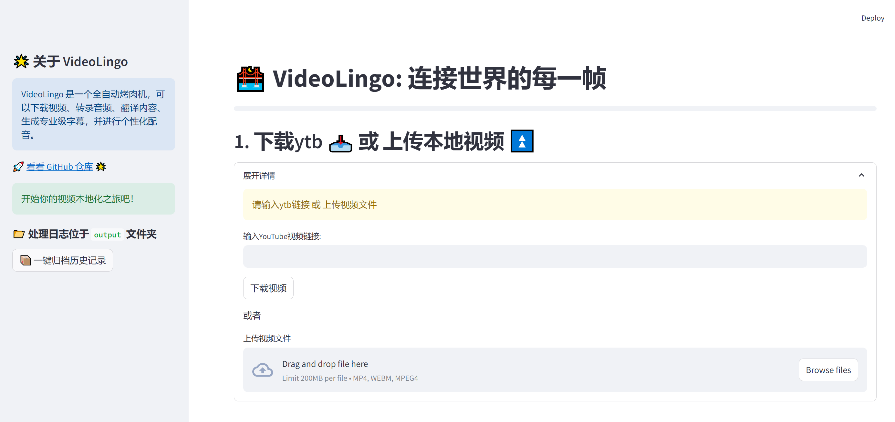
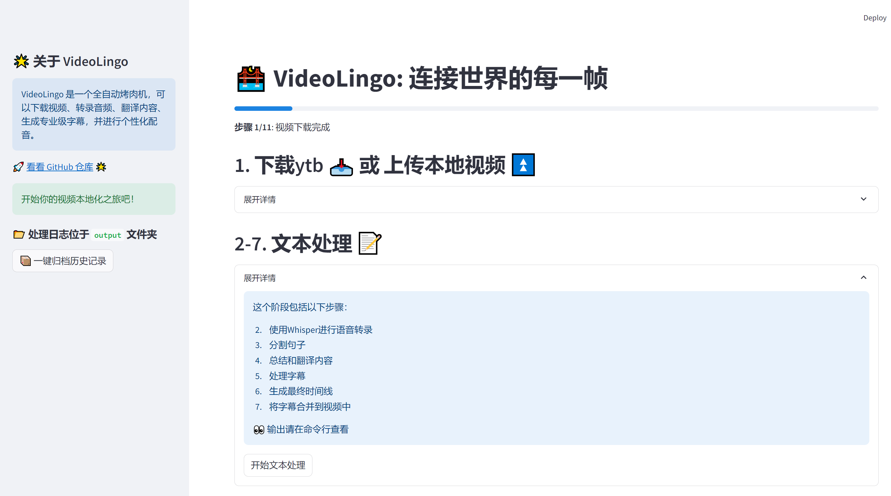

# 🌉 VideoLingo: 连接世界的每一帧


<a href="https://colab.research.google.com/github/Huanshere/VideoLingo/blob/main/Colab_VideoLingo.ipynb" target="_parent"></a>


[中文](README.md) | [English](README.en.md)

🎥✨ 厌倦了杂乱的 YouTube 翻译？发现无缝视频本地化的魔力吧！

## 🌟 我们提供什么

- 🎬 Netflix 品质的字幕：告别业余翻译！
  
- 💰 极低成本：仅需 2 元即可创作 5 分钟的跨语言字幕。
  
- 🤖 利用 NLP 和 LLM 进行专业级翻译和字幕对齐。

- 🎤 个性化配音的语音克隆（测试版功能）。

> 看看演示吧！🚀💪

https://github.com/user-attachments/assets/d3fa8750-0ec3-42c7-87f2-efd50a089f27

## 💡 特点

- 📚 使用 NLP 和 LLM 进行字幕分割

- 🧠 智能术语知识库，实现上下文感知翻译

- 🔄 三步翻译过程：直接翻译 - 反思 - 改进

- 🎯 精确的单词级字幕对齐

- 🎤 GPT-SoVits 高质量的个性化配音

- 👨‍💻 开发者友好：逐步结构化文件，便于自定义 : [英文文档](./docs/README_guide_en.md) | [中文文档](./docs/README_guide_zh.md)

## 🎯 如何使用

1. 下载一键启动包windows（推荐）

2. 配置 `config.py` 中的 api_key

3. 点击 `一键启动.bat` 启动 Streamlit！

<div style="display: flex; justify-content: space-around;">
  
  
</div>


## 🚀 从头安装

> **注意**：此安装指南适用于 Mac 和 Windows 系统。
> 如需配音功能还需要下载 GPT-SoVITS-Inference 放在当前目录下。

1. 克隆仓库：
   ```bash
   git clone https://github.com/Huanshere/VideoLingo.git
   cd VideoLingo
   ```

2. 设置并激活 Conda 虚拟环境：
   ```bash
   conda create -n videolingo python=3.12.0
   conda activate videolingo
   ```

3. 配置 `config.py`

4. 执行安装脚本：
   ```bash
   python install.py
   ```

5. 🎉启动streamlt!
   ```bash
   streamlit run st.py
   ```

## 🛣️ 路线图

- [ ] 优化 tts 语气

- [ ] 整块翻译再分块对齐提高翻译质量

## 🙏 致谢

感谢以下开源项目的贡献:

- [whisper](https://github.com/openai/whisper): OpenAI的开源自动语音识别系统

- [whisper-timestamped](https://github.com/linto-ai/whisper-timestamped): 为Whisper添加时间戳功能的扩展
- [yt-dlp](https://github.com/yt-dlp/yt-dlp): 用于下载YouTube视频和其他网站内容的命令行工具
- [GPT-SoVITS](https://github.com/RVC-Project/GPT-SoVITS): 基于GPT和SoVITS的语音合成系统
- [FFmpeg](https://github.com/FFmpeg/FFmpeg): 用于处理多媒体内容的完整跨平台解决方案
- [Ultimate Vocal Remover GUI v5 (UVR5)](https://github.com/Anjok07/ultimatevocalremovergui): 用于分离音乐中的人声和伴奏的工具

## Star 历史

[](https://star-history.com/#Huanshere/VideoLingo)

