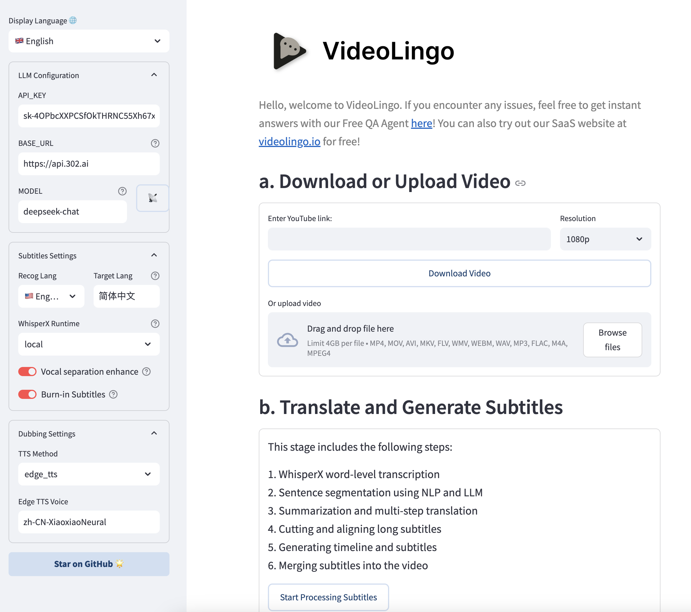

# 🚀 Getting Started

## 📋 API Configuration
VideoLingo requires an LLM and TTS(optional). For the best quality, use claude-3-5-sonnet-20240620 with Azure TTS. Alternatively, for a fully local setup with no API key needed, use Ollama for the LLM and Edge TTS for dubbing. In this case, set `max_workers` to 1 and `summary_length` to a low value like 2000 in `config.yaml`.

### 1. **Get API_KEY for LLM**:

| Recommended Model | Vendor | Quality | Cost-efficiency |
|:-----|:---------|:-----|:---------|
| claude-sonnet-4-6 | [Anthropic](https://www.anthropic.com) | 🤩 | ⭐⭐⭐ |
| claude-opus-4-6 | [Anthropic](https://www.anthropic.com) | 🏆 | ⭐⭐ |
| gpt-5.2 | [OpenAI](https://openai.com) | 🤩 | ⭐⭐⭐ |
| gemini-3-flash | [Google](https://ai.google.dev) | 😃 | ⭐⭐⭐⭐⭐ |
| gemini-3.1-pro | [Google](https://ai.google.dev) | 🤩 | ⭐⭐⭐ |
| minimax-m2.7 | [MiniMax](https://www.minimax.io) | 🤩 | ⭐⭐⭐⭐⭐ |
| kimi-k2.5 | [Moonshot AI](https://www.moonshot.cn) | 😃 | ⭐⭐⭐⭐ |
| deepseek-v3 | [DeepSeek](https://www.deepseek.com) | 🥳 | ⭐⭐⭐⭐ |
| qwen3-32b | [Ollama](https://ollama.ai) self-hosted | 😃 | ♾️ Free |

> **Tip:** Model pricing changes frequently. Check each vendor's website for current rates. [models.dev](https://models.dev) offers cross-vendor price and capability comparison.
>
> **API proxy:** If you cannot access overseas APIs directly, [OpenRouter](https://openrouter.ai) is recommended (supports all models above, unified OpenAI-format API, pay-per-use with no monthly fee).

Note: Supports OpenAI format, you can try different models at your risk. However, the process involves multi-step reasoning chains and complex JSON formats, **not recommended to use models smaller than 30B**.

### 2. **TTS API**
VideoLingo provides multiple TTS integration methods. Here's a comparison (skip if only using translation without dubbing)

| TTS Solution | Provider | Pros | Cons | Chinese Effect | Non-Chinese Effect |
|:---------|:---------|:-----|:-----|:---------|:-----------|
| 🔊 Azure TTS ⭐ | [302AI](https://gpt302.saaslink.net/C2oHR9) | Natural effect | Limited emotions | 🤩 | 😃 |
| 🎙️ OpenAI TTS | [302AI](https://gpt302.saaslink.net/C2oHR9) | Realistic emotions | Chinese sounds foreign | 😕 | 🤩 |
| 🎤 Fish TTS | [302AI](https://gpt302.saaslink.net/C2oHR9) | Authentic native | Limited official models | 🤩 | 😂 |
| 🎙️ SiliconFlow FishTTS | [SiliconFlow](https://cloud.siliconflow.cn/i/ttKDEsxE) | Voice Clone | Unstable cloning effect | 😃 | 😃 |
| 🗣 Edge TTS | Local | Completely free | Average effect | 😐 | 😐 |
| 🗣️ GPT-SoVITS | Local | Best voice cloning | Only supports Chinese/English, requires local inference, complex setup | 🏆 | 🚫 |

- For SiliconFlow FishTTS, get key from [SiliconFlow](https://cloud.siliconflow.cn/i/ttKDEsxE), note that cloning feature requires paid credits;
- For OpenAI TTS, Azure TTS, and Fish TTS, use [302AI](https://gpt302.saaslink.net/C2oHR9) - one API key provides access to all three services
> Wanna use your own TTS? Modify in `core/all_tts_functions/custom_tts.py`!

<details>
<summary>SiliconFlow FishTTS Tutorial</summary>

Currently supports 3 modes:

1. `preset`: Uses fixed voice, can preview on [Official Playground](https://cloud.siliconflow.cn/playground/text-to-speech/17885302608), default is `anna`.
2. `clone(stable)`: Corresponds to fishtts api's `custom`, uses voice from uploaded audio, automatically samples first 10 seconds of video for voice, better voice consistency.
3. `clone(dynamic)`: Corresponds to fishtts api's `dynamic`, uses each sentence as reference audio during TTS, may have inconsistent voice but better effect.

</details>

<details>
<summary>How to choose OpenAI voices?</summary>

Voice list can be found on the [official website](https://platform.openai.com/docs/guides/text-to-speech/voice-options), such as `alloy`, `echo`, `nova`, etc. Modify `openai_tts.voice` in `config.yaml`.

</details>
<details>
<summary>How to choose Azure voices?</summary>

Recommended to try voices in the [online demo](https://speech.microsoft.com/portal/voicegallery). You can find the voice code in the code on the right, e.g. `zh-CN-XiaoxiaoMultilingualNeural`

</details>

<details>
<summary>How to choose Fish TTS voices?</summary>

Go to the [official website](https://fish.audio/en/) to listen and choose voices. Find the voice code in the URL, e.g. Dingzhen is `54a5170264694bfc8e9ad98df7bd89c3`. Popular voices are already added in `config.yaml`. To use other voices, modify the `fish_tts.character_id_dict` dictionary in `config.yaml`.

</details>

<details>
<summary>GPT-SoVITS-v2 Tutorial</summary>

1. Check requirements and download the package from [official Yuque docs](https://www.yuque.com/baicaigongchang1145haoyuangong/ib3g1e/dkxgpiy9zb96hob4#KTvnO).

2. Place `GPT-SoVITS-v2-xxx` and `VideoLingo` in the same directory. **Note they should be parallel folders.**

3. Choose one of the following ways to configure the model:

   a. Self-trained model:
   - After training, `tts_infer.yaml` under `GPT-SoVITS-v2-xxx\GPT_SoVITS\configs` will have your model path auto-filled. Copy and rename it to `your_preferred_english_character_name.yaml`
   - In the same directory as the `yaml` file, place reference audio named `your_preferred_english_character_name_reference_audio_text.wav` or `.mp3`, e.g. `Huanyuv2_Hello, this is a test audio.wav`
   - In VideoLingo's sidebar, set `GPT-SoVITS Character` to `your_preferred_english_character_name`.

   b. Use pre-trained model:
   - Download my model from [here](https://vip.123pan.cn/1817874751/8137723), extract and overwrite to `GPT-SoVITS-v2-xxx`.
   - Set `GPT-SoVITS Character` to `Huanyuv2`.

   c. Use other trained models:
   - Place `xxx.ckpt` in `GPT_weights_v2` folder and `xxx.pth` in `SoVITS_weights_v2` folder.
   - Following method a, rename `tts_infer.yaml` and modify `t2s_weights_path` and `vits_weights_path` under `custom` to point to your models, e.g.:
  
      ```yaml
      # Example config for method b:
      t2s_weights_path: GPT_weights_v2/Huanyu_v2-e10.ckpt
      version: v2
      vits_weights_path: SoVITS_weights_v2/Huanyu_v2_e10_s150.pth
      ```
   - Following method a, place reference audio in the same directory as the `yaml` file, named `your_preferred_english_character_name_reference_audio_text.wav` or `.mp3`, e.g. `Huanyuv2_Hello, this is a test audio.wav`. The program will auto-detect and use it.
   - ⚠️ Warning: **Please use English for `character_name`** to avoid errors. `reference_audio_text` can be in Chinese. Currently in beta, may produce errors.


   ```
   # Expected directory structure:
   .
   ├── VideoLingo
   │   └── ...
   └── GPT-SoVITS-v2-xxx
       ├── GPT_SoVITS
       │   └── configs
       │       ├── tts_infer.yaml
       │       ├── your_preferred_english_character_name.yaml
       │       └── your_preferred_english_character_name_reference_audio_text.wav
       ├── GPT_weights_v2
       │   └── [your GPT model file]
       └── SoVITS_weights_v2
           └── [your SoVITS model file]
   ```
        
After configuration, select `Reference Audio Mode` in the sidebar (see Yuque docs for details). During dubbing, VideoLingo will automatically open GPT-SoVITS inference API port in the command line, which can be closed manually after completion. Note that stability depends on the base model chosen.</details>

## 🛠️ Quick Start

VideoLingo supports Windows, macOS and Linux systems, and can run on CPU or GPU.

> **Note:** To use NVIDIA GPU acceleration on Windows, please complete the following steps first:
> 1. Install [CUDA Toolkit 12.6](https://developer.download.nvidia.com/compute/cuda/12.6.0/local_installers/cuda_12.6.0_560.76_windows.exe) or newer (12.8 / 12.9 / 13.x all work — the install script auto-adapts)
> 2. Install [CUDNN 9.3.0](https://developer.download.nvidia.com/compute/cudnn/9.3.0/local_installers/cudnn_9.3.0_windows.exe)
> 3. Add `C:\Program Files\NVIDIA\CUDNN\v9.3\bin\12.6` to your system PATH
> 4. Restart your computer
>
> ⚠️ **Pitfall:** The install script uses `nvidia-smi` to detect your driver's CUDA version and auto-selects the best PyTorch wheel (cu129 / cu128 / cu126). For RTX 50 series (Blackwell) GPUs, cu129 wheels with sm_100 kernels are selected automatically. **Do NOT manually install cu130/cu131 PyTorch** — this causes ctranslate2 to fail with `cublas64_12.dll not found`.

> **Note:** FFmpeg is required. Please install it via package managers:
> - Windows: ```choco install ffmpeg``` (via [Chocolatey](https://chocolatey.org/))
> - macOS: ```brew install ffmpeg``` (via [Homebrew](https://brew.sh/))
> - Linux: ```sudo apt install ffmpeg``` (Debian/Ubuntu) or ```sudo dnf install ffmpeg``` (Fedora)
>
> ⚠️ **Pitfall:** Do NOT use conda-forge ffmpeg (it lacks the libmp3lame encoder). Use the system package manager to install a full build.

Before installing VideoLingo, ensure you have installed Git and Anaconda.

1. Clone the project:
   ```bash
   git clone https://github.com/Huanshere/VideoLingo.git
   cd VideoLingo
   ```

2. Create and activate virtual environment (**must be python=3.10.0**):
   ```bash
   conda create -n videolingo python=3.10.0 -y
   conda activate videolingo
   ```

   > ⚠️ **Pitfall:** Make sure pip is using the conda env's site-packages. On Windows, if the `site-packages` directory is not writable (e.g. under `C:\ProgramData\anaconda3\`), pip silently installs to the user directory instead. If this happens, run the terminal as administrator.

3. Run installation script:
   ```bash
   python install.py
   ```

   > ⚠️ **Install order matters:** `install.py` installs dependencies in the correct order: PyTorch first (locks CUDA version), then demucs with `--no-deps` (prevents torchaudio downgrade), then the rest. **Do not rearrange manually.**

4. 🎉 Launch Streamlit app by running the command or double-clicking `OneKeyStart.bat`:
   ```bash
   streamlit run st.py
   ```

5. Set key in sidebar of popup webpage and start using~

   

6. (Optional) More settings can be manually modified in `config.yaml`, watch command line output during operation. To use custom terms, add them to `custom_terms.xlsx` before processing, e.g. `Baguette | French bread | Not just any bread!`.

> Need help? Our [AI Assistant](https://share.fastgpt.in/chat/share?shareId=066w11n3r9aq6879r4z0v9rh) is here to guide you through any issues!

## 🏭 Batch Mode (beta)

Document: [English](/batch/README.md) | [Chinese](/batch/README.zh.md)

Note: This section is still in early development and may have limited functionality

## 🚨 Common Errors & Pitfalls

1. **'All array must be of the same length' or 'Key Error' during translation**: 
   - Reason 1: Weaker models have poor JSON format compliance causing response parsing errors.
   - Reason 2: LLM may refuse to translate sensitive content.
   Solution: Check `response` and `msg` fields in `output/gpt_log/error.json`, delete the `output/gpt_log` folder and retry.

2. **'Retry Failed', 'SSL', 'Connection', 'Timeout'**: Usually network issues. Solution: Users in mainland China please switch network nodes and retry.

3. **local_files_only=True**: Model download failure due to network issues, need to verify network can ping `huggingface.co`.

4. **`cublas64_12.dll not found`**: Installed CUDA 13.x and used cu130/cu131 PyTorch wheels. **Solution:** Must use cu129, cu128, or cu126 wheels (`install.py` handles this automatically via `nvidia-smi` detection) because ctranslate2 only supports CUDA 12. Re-run `python install.py`.

5. **Whisper model loading segfaults silently**: ctranslate2 version mismatches cuDNN version. **Solution:** Ensure `ctranslate2>=4.5.0` (supports cuDNN 9, which PyTorch 2.6+ ships with).

6. **`RuntimeError: Weights only load failed`**: PyTorch ≥2.6 changed `torch.load` default behavior. **Solution:** Already fixed via monkey-patch in `whisperX_local.py`. If you see this, your code is not up to date.

7. **WhisperX transcription hangs in Streamlit (CPU/GPU idle)**: `librosa.load()` deadlocks in Streamlit's non-main thread. **Solution:** Already fixed by replacing with `whisperx.audio.load_audio()` (ffmpeg subprocess). If you see this, your code is not up to date.

8. **spacy `Can't find model 'xx_core_web_md'` (but pip says installed)**: pip installed the model to user directory instead of conda env. **Solution:** Run terminal as administrator, or manually install with conda env's python:
   ```bash
   python -m pip install xx-core-web-md --no-user --force-reinstall --no-deps
   ```

9. **torchaudio version drops to 1.x or 2.1.x after pip install**: demucs's `torchaudio<2.2` constraint causes downgrade. **Solution:** Never `pip install demucs` directly — must use `--no-deps`. `install.py` handles this correctly.
