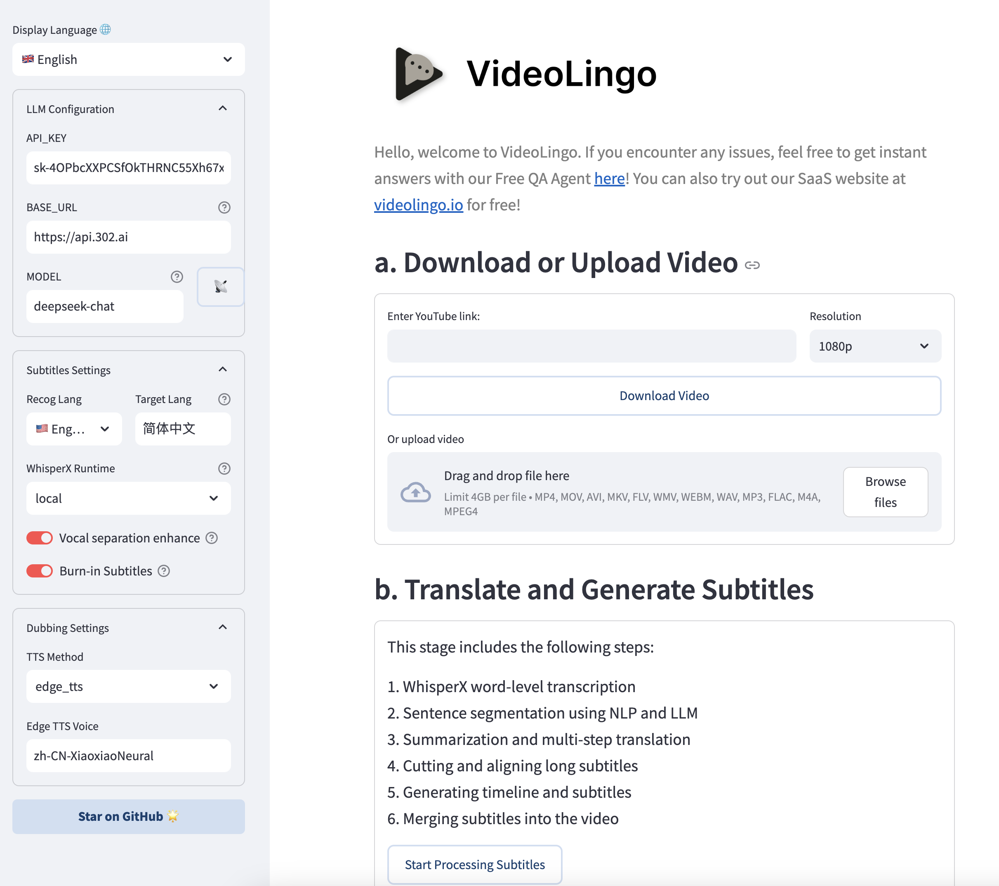

# 🚀 Getting Started

## 📋 API Configuration
VideoLingo uses an LLM for translation. TTS is optional and only needed for dubbing. Choose your own provider and model.

### 1. **Get API_KEY for LLM**:

Set the API URL, key and model in the sidebar. The client uses OpenAI-compatible
Chat Completions, with structured JSON required by several processing steps.
Use a model supported by your endpoint; parameter count alone does not establish
translation quality or JSON reliability. Enable JSON mode only if supported.

[OpenLux](https://www.openlux.ai/register?aff=wKYu) is the recommended relay. Set the API base URL to `https://api.openlux.ai/v1`. Pick one of the three models below. Prices are approximate OpenLux auto-routing group rates measured on the gateway (USD per 1M tokens; they vary by routing group):

| Recommendation | Model ID | Input | Output |
|:---------------|:---------|------:|-------:|
| Default, best value | `gpt-6-luna` | $0.006 | $0.029 |
| Better quality | `gpt-6-sol` | $0.074 | $0.37 |
| Best quality | `claude-opus-5-5` | $0.71 | $3.53 |

Other OpenAI-compatible providers also work, for example OpenRouter at `https://openrouter.ai/api/v1`, or a local compatible server. The application requires a non-empty key field even when that server does not authenticate requests; use a placeholder only for a server that explicitly ignores the key. Edge TTS requires network access and is not an offline synthesizer.

### 2. **TTS API**
VideoLingo provides multiple TTS integration methods. Here's a comparison (skip if only using translation without dubbing)

| TTS Solution | Provider | Pros | Cons | Chinese Effect | Non-Chinese Effect |
|:---------|:---------|:-----|:-----|:---------|:-----------|
| 🔊 Azure TTS ⭐ | [302AI](https://gpt302.saaslink.net/C2oHR9) | Natural effect | Limited emotions | 🤩 | 😃 |
| 🎙️ OpenAI TTS | [302AI](https://gpt302.saaslink.net/C2oHR9) | Realistic emotions | Chinese sounds foreign | 😕 | 🤩 |
| 🎤 Fish TTS | [302AI](https://gpt302.saaslink.net/C2oHR9) | Authentic native | Limited official models | 🤩 | 😂 |
| 🎙️ SiliconFlow FishTTS | [SiliconFlow](https://cloud.siliconflow.cn/i/ttKDEsxE) | Voice Clone | Unstable cloning effect | 😃 | 😃 |
| Edge TTS | Online service | No separate API key in this adapter | Requires network access | — | — |
| 🗣️ GPT-SoVITS | Local | Best voice cloning | Only supports Chinese/English, requires local inference, complex setup | 🏆 | 🚫 |

- For SiliconFlow FishTTS, get key from [SiliconFlow](https://cloud.siliconflow.cn/i/ttKDEsxE), note that cloning feature requires paid credits;
- For OpenAI TTS, Azure TTS, and Fish TTS, use [302AI](https://gpt302.saaslink.net/C2oHR9) - one API key provides access to all three services
> For a custom TTS adapter, edit `core/tts_backend/custom_tts.py`.

<details>
<summary>SiliconFlow FishTTS Tutorial</summary>

Currently supports 3 modes:

1. `preset`: Uses fixed voice, can preview on [Official Playground](https://cloud.siliconflow.cn/playground/text-to-speech/17885302608), default is `anna`.
2. `clone(stable)`: API mode `custom`; combines eligible reference segments from the task list, subject to text-length and duration limits, and uploads a reusable voice. This is not necessarily the first ten seconds of the video.
3. `clone(dynamic)`: API mode `dynamic`; uses the current sentence's reference clip. Voice consistency and quality depend on the reference and service, with no guaranteed improvement over custom mode.

</details>

<details>
<summary>How to choose OpenAI voices?</summary>

Voice list can be found on the [official website](https://platform.openai.com/docs/guides/text-to-speech/voice-options), such as `alloy`, `echo`, `nova`, etc. Modify `openai_tts.voice` in `config.yaml`.

</details>
<details>
<summary>How to choose Azure voices?</summary>

Recommended to try voices in the [online demo](https://speech.microsoft.com/portal/voicegallery). You can find the voice code in the code on the right, e.g. `zh-CN-XiaoxiaoMultilingualNeural`

</details>

<details>
<summary>How to choose Fish TTS voices?</summary>

Go to the [official website](https://fish.audio/en/) to listen and choose voices. Find the voice code in the URL, e.g. Dingzhen is `54a5170264694bfc8e9ad98df7bd89c3`. Popular voices are already added in `config.yaml`. To use other voices, modify the `fish_tts.character_id_dict` dictionary in `config.yaml`.

</details>

<details>
<summary>GPT-SoVITS-v2 Tutorial</summary>

1. Check requirements and download the package from [official Yuque docs](https://www.yuque.com/baicaigongchang1145haoyuangong/ib3g1e/dkxgpiy9zb96hob4#KTvnO).

2. Place `GPT-SoVITS-v2-xxx` and `VideoLingo` in the same directory. **Note they should be parallel folders.**

3. Choose one of the following ways to configure the model:

   a. Self-trained model:
   - After training, `tts_infer.yaml` under `GPT-SoVITS-v2-xxx\GPT_SoVITS\configs` will have your model path auto-filled. Copy and rename it to `your_preferred_english_character_name.yaml`
   - In the same directory as the `yaml` file, place reference audio named `your_preferred_english_character_name_reference_audio_text.wav` or `.mp3`, e.g. `Huanyuv2_Hello, this is a test audio.wav`
   - In VideoLingo's sidebar, set `GPT-SoVITS Character` to `your_preferred_english_character_name`.

   b. Use pre-trained model:
   - Download my model from [here](https://vip.123pan.cn/1817874751/8137723), extract and overwrite to `GPT-SoVITS-v2-xxx`.
   - Set `GPT-SoVITS Character` to `Huanyuv2`.

   c. Use other trained models:
   - Place `xxx.ckpt` in `GPT_weights_v2` folder and `xxx.pth` in `SoVITS_weights_v2` folder.
   - Following method a, rename `tts_infer.yaml` and modify `t2s_weights_path` and `vits_weights_path` under `custom` to point to your models, e.g.:
  
      ```yaml
      # Example config for method b:
      t2s_weights_path: GPT_weights_v2/Huanyu_v2-e10.ckpt
      version: v2
      vits_weights_path: SoVITS_weights_v2/Huanyu_v2_e10_s150.pth
      ```
   - Following method a, place reference audio in the same directory as the `yaml` file, named `your_preferred_english_character_name_reference_audio_text.wav` or `.mp3`, e.g. `Huanyuv2_Hello, this is a test audio.wav`. The program will auto-detect and use it.
   - ⚠️ Warning: **Please use English for `character_name`** to avoid errors. `reference_audio_text` can be in Chinese. Currently in beta, may produce errors.


   ```
   # Expected directory structure:
   .
   ├── VideoLingo
   │   └── ...
   └── GPT-SoVITS-v2-xxx
       ├── GPT_SoVITS
       │   └── configs
       │       ├── tts_infer.yaml
       │       ├── your_preferred_english_character_name.yaml
       │       └── your_preferred_english_character_name_reference_audio_text.wav
       ├── GPT_weights_v2
       │   └── [your GPT model file]
       └── SoVITS_weights_v2
           └── [your SoVITS model file]
   ```
        
After configuration, select `Reference Audio Mode` in the sidebar (see Yuque docs for details). During dubbing, VideoLingo will automatically open GPT-SoVITS inference API port in the command line, which can be closed manually after completion. Note that stability depends on the base model chosen.</details>

## 🛠️ Quick Start

VideoLingo supports Windows, macOS and Linux systems, and can run on CPU or GPU.

### Prerequisites

Install [Git](https://git-scm.com/downloads), [uv](https://docs.astral.sh/uv/getting-started/installation/) and [FFmpeg](https://ffmpeg.org/download.html). The linked uv page provides standalone installers that do not require Python. Reopen your terminal and check `git --version`, `uv --version` and `ffmpeg -version`.

On Windows, pick one of the Windows builds linked from the FFmpeg download page and add its `bin` directory to PATH. On macOS use `brew install ffmpeg`; on Debian/Ubuntu use `sudo apt install ffmpeg`. The default Qwen3-ASR recognition only calls the FFmpeg command-line tool. FFmpeg shared libraries and the FFmpeg 4–7 limit apply only if you manually install WhisperX; see [WhisperX (manual install)](whisperx-manual.en-US.md#ffmpeg-runtime). Subtitle rendering needs the subtitles filter and suitable fonts; the installer checks/installs Noto CJK fonts on Linux.

<a id="asr-runtime"></a>
### Speech recognition (Qwen3-ASR + ForcedAligner)

Local recognition transcribes with **Qwen3-ASR** and then produces word timestamps with **Qwen3-ForcedAligner-0.6B**. With vocal separation enabled, transcription uses the original audio and alignment uses the separated vocals.

- **Model size**: sidebar "Qwen3-ASR Model Size" or `whisper.qwen_model` in `config.yaml`. `1.7b` (default) is more accurate; `0.6b` is faster and uses less memory. The aligner is always ForcedAligner-0.6B.
- **Engine**: `whisper.qwen_engine: auto` selects it automatically; you normally do not need to change it.

| Platform | Engine | Models | Notes |
|:---------|:-------|:-------|:------|
| Apple Silicon Mac | MLX (mlx-audio) | `mlx-community/Qwen3-ASR-{1.7B,0.6B}-8bit`, `mlx-community/Qwen3-ForcedAligner-0.6B-8bit` | Requires **macOS 14 or newer** (mlx only ships macOS ≥14 arm64 wheels) |
| Windows / Linux + NVIDIA | Official qwen-asr (transformers) | `Qwen/Qwen3-ASR-{1.7B,0.6B}`, `Qwen/Qwen3-ForcedAligner-0.6B` | `cuda:0`, bf16 when the GPU supports it, otherwise fp16 |
| Windows / Linux without NVIDIA | Same | Same | CPU fp32 works but is **slow**; prefer 0.6B or the ElevenLabs runtime |
| Intel Mac | — | — | The pinned PyTorch 2.8 has no macOS x86_64 wheels, so installation is currently not possible; the installer stops with an error before installing dependencies |

- On Apple Silicon the default requirements install mlx-audio, not qwen-asr; using `qwen_engine: transformers` there needs a separate environment. Below macOS 14 the installer stops with an error. If an older environment has WhisperX, rerunning `installer.py` first uninstalls the WhisperX stack (whisperx, torchcodec, faster-whisper, ctranslate2, pyannote-*), which conflicts with the MLX dependencies.
- **Model downloads**: models are downloaded from Hugging Face on first use (several GB for 1.7B plus the aligner). Set `HF_ENDPOINT` to use a mirror. If `_model_cache/<last part of the repo id>/config.json` exists (for example `_model_cache/Qwen3-ASR-1.7B`), that local copy is used.
- **Languages**: every recognition language in the sidebar is supported (Qwen3-ASR supports 30 languages). With `Auto`, each window of about 3 minutes is first probed with up to three 20 s clips, the clips vote on the language, and the window is then transcribed with that language forced (recognition takes about a third longer); for mixed speech the first language reported is treated as primary. If `Auto` detects a language outside the sidebar list (e.g. Korean, Vietnamese, Thai), sentence splitting picks a spaced or unspaced joiner automatically and uses the matching spaCy pipeline, or punctuation-only splitting when spaCy has none.
- **Degenerate output**: if a window's transcript is one phrase looping, or much shorter than what its probe clips heard, it is retried in 60 s windows; if it is still degenerate, recognition stops with an error asking you to set the language, instead of passing a broken transcript on. With a manually selected language, a window whose transcript is unusually sparse (under 2 letters/digits per second) is checked against a few auto-language probe clips; if they heard far more it fails, and if the probes heard a different language it fails right away with a hint that the selected language may not match the audio (use auto or switch the model size), instead of passing a retry in another language downstream. A transcript whose writing system clearly does not fit the selected language (e.g. Korean text with English or Chinese selected, Japanese with almost no kana) fails the same way; that check reads the text only, adds no recognition time and runs after each window, so it stops at the first mismatching window. Silence and music never trigger this.
- **Known limitation**: choosing the wrong language among languages written in Latin letters (e.g. Spanish selected for an English video) cannot be detected. The model may **translate** some windows into the selected language instead of transcribing what was said, leaving part original and part translation. Prefer `Auto`, or double-check the recognition language before processing.
- The transcription cache distinguishes backend, model size and engine; changing any of them re-runs recognition.
- WhisperX is not an installer option. To use it (including the Belle model for Chinese), install the packages yourself: [WhisperX (manual install)](whisperx-manual.en-US.md).
- The official `qwenllm/qwen3-asr` Docker image can host a standalone Qwen3-ASR service, but VideoLingo does not call it directly.

<a id="gpu-runtime"></a>
### GPU runtime

- Install a driver compatible with your NVIDIA GPU. `nvidia-smi` reports the driver's CUDA capability, not an installed Toolkit version.
- On hosts, the installer selects PyTorch `cu128` for a reported capability >=12.8, otherwise `cu126` when NVIDIA is detected. An unreadable capability falls back to cu126, which is not a guarantee of compatibility with an old driver. Without NVIDIA it selects CPU packages. Compatible existing packages may be reused.
- The default Qwen3-ASR runs on PyTorch and uses the CUDA runtime bundled with the PyTorch wheels; no separate cuBLAS/cuDNN installation is needed. A manual WhisperX install needs CUDA 12 cuBLAS and cuDNN 9; see [WhisperX (manual install)](whisperx-manual.en-US.md#cuda-runtime).

The installer selects Python wheels; it does not install a system CUDA Toolkit. Newer CUDA 13-capable drivers do not require CUDA 13 Python packages for this project.

### Install with uv

uv provisions Python 3.13 in `.venv`. Existing application environments are supported on Python 3.10–3.13. The bootstrap command below does not require a preinstalled Python.

1. Clone the project:
   ```bash
   git clone https://github.com/Huanshere/VideoLingo.git
   cd VideoLingo
   ```

2. Create the environment and install dependencies:
   ```bash
    uv run --no-project --python 3.13 setup_env.py
   ```

   `setup_env.py` delegates to `installer.py`: bootstrap packages, matched Torch/torchaudio/torchvision, application requirements (including Qwen3-ASR: mlx-audio on Apple Silicon, qwen-asr elsewhere), spaCy checks, optional PyPI Demucs 4.1, project metadata, fonts and environment checks. Demucs uses normal dependency resolution. Use `--shared` to select `~/.venvs/videolingo`, or `--path` for a custom location.

3. 🎉 Launch Streamlit app:
   ```bash
   .venv\Scripts\streamlit run st.py        # Windows
   .venv/bin/streamlit run st.py            # macOS / Linux
   ```
   Or double-click `OneKeyStart.bat` on Windows.

4. Open `http://localhost:8501` and configure your OpenAI-compatible API URL, key and model in the sidebar. `OneKeyStart.bat` prefers the shared venv, then the project's `.venv`; use the explicit environment command above if you want that checkout's local environment.

   

5. (Optional) More settings can be manually modified in `config.yaml`, watch command line output during operation. To use custom terms, add them to `custom_terms.xlsx` before processing, e.g. `Baguette | French bread | Not just any bread!`.

> Need help? Our [AI Assistant](https://share.fastgpt.in/chat/share?shareId=066w11n3r9aq6879r4z0v9rh) is here to guide you through any issues!

## 🏭 Batch Mode (beta)

Document: [English](/batch/README.md) | [Chinese](/batch/README.zh.md)

Note: This section is still in early development and may have limited functionality

## 🚨 Common Errors & Pitfalls

1. **'All array must be of the same length' or 'Key Error' during translation**: 
   - Reason 1: Weaker models have poor JSON format compliance causing response parsing errors.
   - Reason 2: LLM may refuse to translate sensitive content.
    Inspect `resp_content`, `resp` and `message` in `output/gpt_log/error.json`. Failed validation is logged separately from successful response caches. Diagnose the failing stage before clearing its cached results.

2. **'Retry Failed', 'SSL', 'Connection', 'Timeout'**: Usually network issues. Solution: Users in mainland China please switch network nodes and retry.

3. **`Qwen ASR engine '...' needs the 'qwen-asr' package`** (or `mlx-audio`): the recognition package is missing from the environment. Run `python installer.py` with the same environment used to launch VideoLingo. On Apple Silicon, if you set `qwen_engine: transformers` manually, change it back to `auto`.

4. **`Qwen3-ASR could not detect the language`** or **`... is still degenerate after retrying`**: `Auto` could not determine the language, or the transcript degenerated (a looping phrase, far too little text). Select the recognition language explicitly in the sidebar and retry, or try the other model size.

5. **CUDA out of memory**: switch the Qwen3-ASR model size to 0.6B in the sidebar, or close other programs using the GPU.

6. **mlx cannot be resolved / no matching distribution on macOS**: mlx only ships wheels for Apple Silicon on macOS 14 or newer. Upgrade macOS first.

7. **WhisperX errors** (`cublas64_12.dll not found`, segfaults, `Weights only load failed`, TorchCodec, etc.): these only occur with the WhisperX backend selected; see [WhisperX (manual install)](whisperx-manual.en-US.md#common-errors).

8. **spaCy model missing**: Check that the model was installed into the same environment used to launch VideoLingo. For example, install the English model using that environment's Python:
   ```bash
    .venv\Scripts\python -m spacy download en_core_web_md
   ```

9. **Torch package versions disagree**: Run the selected environment's `python installer.py --check`, then `python installer.py` to repair. The supported family is Torch/torchaudio 2.8.0 with torchvision 0.23.0, using one matching CPU/CUDA build. Current Demucs is PyPI 4.1, not the older Git package requiring a `--no-deps` workaround.
