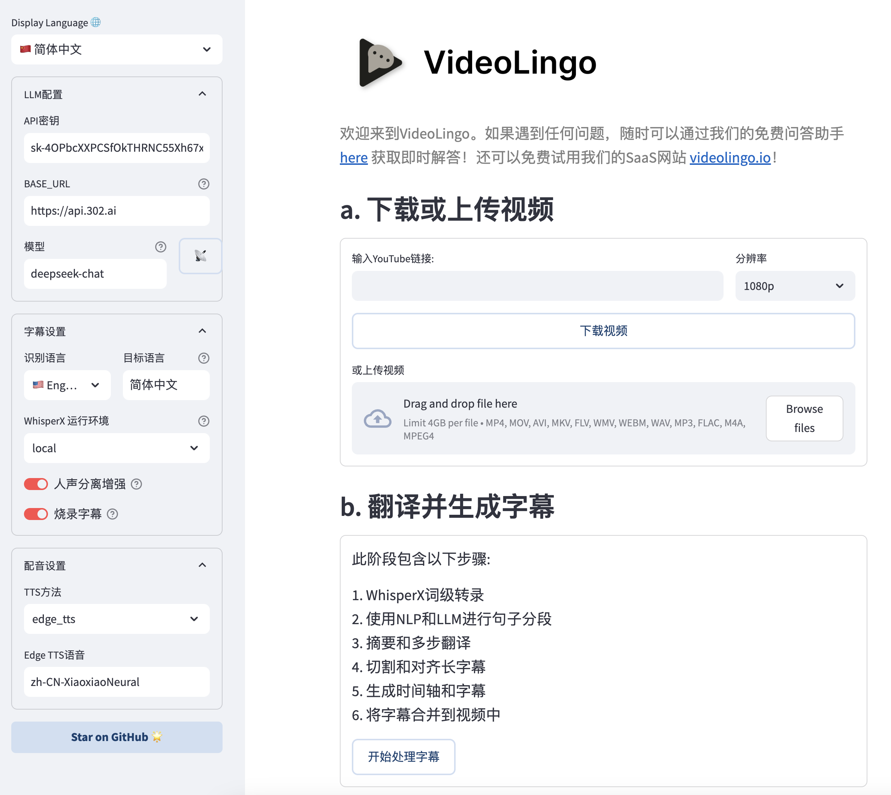

# 🚀 开始使用

## 📋 API 配置指南
本项目需使用大模型和 TTS。追求最佳质量请使用 claude-3-5-sonnet-20240620 与 Azure TTS。也可以选择完全本地化体验，使用 Ollama 作为大模型，Edge TTS 作为配音，无需任何 API key（此时需要在 `config.yaml` 中将 `max_workers` 设为 1，`summary_length` 调低至 2000）。

### 1. **大模型的 API_KEY**：

| 推荐模型 | 推荐提供商 | base_url | 价格 | 效果 |
|:-----|:---------|:---------|:-----|:---------|
| claude-3-5-sonnet-20240620 | [yunwu.ai](https://yunwu.ai/register?aff=TXMB) | https://yunwu.ai | $1 / 1M tokens | 🤩 |
| gpt-4.1 | [yunwu.ai](https://yunwu.ai/register?aff=TXMB) | https://yunwu.ai | $0.5 / 1M tokens | 🤩 |
| gemini-2.0-flash | [302AI](https://gpt302.saaslink.net/C2oHR9) | https://api.302.ai | $0.3 / 1M tokens | 😃 |
| deepseek-v3 | [302AI](https://gpt302.saaslink.net/C2oHR9) | https://api.302.ai | $1 / 1M tokens | 🥳 |
| qwen2.5-coder:32b | [Ollama](https://ollama.ai) | http://localhost:11434 | 0 | 😃 |

注：支持 OpenAI 格式接口，可自行尝试不同模型。但处理过程涉及多步思维链和复杂的json格式，**不建议使用小于 30B 的模型**。

### 2. **TTS 的 API**
VideoLingo提供了多种 tts 接入方式，以下是对比（如不使用配音可跳过）

| TTS 方案 | 提供商 | 优点 | 缺点 | 中文效果 | 非中文效果 |
|:---------|:---------|:-----|:-----|:---------|:-----------|
| 🔊 Azure TTS ⭐ | [302AI](https://gpt302.saaslink.net/C2oHR9) | 效果自然 | 情感不够丰富 | 🤩 | 😃 |
| 🎙️ OpenAI TTS | [302AI](https://gpt302.saaslink.net/C2oHR9) | 情感真实 | 中文听起来像外国人 | 😕 | 🤩 |
| 🎤 Fish TTS | [302AI](https://gpt302.saaslink.net/C2oHR9) | 真是本地人 | 官方模型有限 | 🤩 | 😂 |
| 🎙️ SiliconFlow FishTTS | [硅基流动](https://cloud.siliconflow.cn/i/ttKDEsxE) | 语音克隆 | 克隆效果不稳定 | 😃 | 😃 |
| 🗣 Edge TTS | 本地 | 完全免费 | 效果一般 | 😐 | 😐 |
| 🗣️ GPT-SoVITS | 本地 | 最强语音克隆 | 只支持中英文，需要本地训练推理，配置麻烦 | 🏆 | 🚫 |

- SiliconFlow FishTTS 请在 [硅基流动](https://cloud.siliconflow.cn/i/ttKDEsxE) 获取key，注意克隆功能需要付费充值积分；
- OpenAI TTS、Azure TTS 和 Fish TTS，仅支持 [302AI](https://gpt302.saaslink.net/C2oHR9) - 一个 API key 即可使用所有服务
> 现在还可以在 `core/all_tts_functions/custom_tts.py` 里自定义tts渠道！

<details>
<summary>SiliconFlow FishTTS 使用教程</summary>

目前支持 3 种模式：

1. `preset`: 使用固定音色，可以在 [官网Playground](https://cloud.siliconflow.cn/playground/text-to-speech/17885302608) 试听，默认 `anna`。
2. `clone(stable)`: 对应 fishtts api 的 `custom`，使用一段上传音频的音色，会自动采集视频前十秒声音作为音色使用，音色一致性更好。
3. `clone(dynamic)`: 对应 fishtts api 的 `dynamic`，在 tts 过程使用每一句作为参考音频，可能出现音色不一致，但效果更好。

</details>

<details>
<summary>OpenAI 声音怎么选？</summary>

声音列表可以在 [官网](https://platform.openai.com/docs/guides/text-to-speech/voice-options) 找到，例如 `alloy`, `echo`, `nova`等，在 `config.yaml` 中修改 `openai_tts.voice` 即可。

</details>
<details>
<summary>Azure 声音怎么选？</summary>

建议在 [在线体验](https://speech.microsoft.com/portal/voicegallery) 中试听选择你想要的声音，在右边的代码中可以找到该声音对应的代号，例如 `zh-CN-XiaoxiaoMultilingualNeural`

</details>

<details>
<summary>Fish TTS 声音怎么选？</summary>

前往 [官网](https://fish.audio/zh-CN/) 中试听选择你想要的声音，在 URL 中可以找到该声音对应的代号，例如丁真是 `54a5170264694bfc8e9ad98df7bd89c3`，热门的几种声音已添加在 `config.yaml` 中。如需使用其他声音，请在 `config.yaml` 中修改 `fish_tts.character_id_dict` 字典。

</details>

<details>
<summary>GPT-SoVITS-v2 使用教程</summary>

1. 前往 [官方的语雀文档](https://www.yuque.com/baicaigongchang1145haoyuangong/ib3g1e/dkxgpiy9zb96hob4#KTvnO) 查看配置要求并下载整合包。

2. 将 `GPT-SoVITS-v2-xxx` 与 `VideoLingo` 放在同一个目录下。**注意是两文件夹并列。**

3. 选择以下任一方式配置模型：

   a. 自训练模型：
   - 训练好模型后， `GPT-SoVITS-v2-xxx\GPT_SoVITS\configs` 下的 `tts_infer.yaml` 已自动填写好你的模型地址，将其复制并重命名为 `你喜欢的英文角色名.yaml`
   - 在和 `yaml` 文件同个目录下，放入后续使用的参考音，命名为 `你喜欢的英文角色名_参考音频的文字内容.wav` 或 `.mp3`，例如 `Huanyuv2_你好，这是一条测试音频.wav`
   - 在 VideoLingo 网页的侧边栏中，将 `GPT-SoVITS 角色` 配置为 `你喜欢的英文角色名`。

   b. 使用预训练模型：
   - 从 [这里](https://vip.123pan.cn/1817874751/8137723) 下载我的模型，解压后覆盖到 `GPT-SoVITS-v2-xxx`。
   - 在 `GPT-SoVITS 角色` 配置为 `Huanyuv2`。

   c. 使用其他训练好的模型：
   - 将 `xxx.ckpt` 模型文件放在 `GPT_weights_v2` 文件夹下，将 `xxx.pth` 模型文件放在 `SoVITS_weights_v2` 文件夹下。
   - 参考方法 a，重命名 `tts_infer.yaml` 文件，并修改文件中的 `custom` 部分的 `t2s_weights_path` 和 `vits_weights_path` 指向你的模型，例如：
  
      ```yaml
      # 示例 法 b 的配置：
      t2s_weights_path: GPT_weights_v2/Huanyu_v2-e10.ckpt
      version: v2
      vits_weights_path: SoVITS_weights_v2/Huanyu_v2_e10_s150.pth
      ```
   - 参考方法 a，在和 `yaml` 文件同个目录下，放入后续使用的参考音频，命名为 `你喜欢的英文角色名_参考音频的文字内容.wav` 或 `.mp3`，例如 `Huanyuv2_你好，这是一条测试音频.wav`，程序会自动识别并使用。
   - ⚠️ 警告：**请使用英文命名 `角色名`** ，否则会出现错误。 `参考音频的文字内容` 可以使用中文。目前仍处于测试版，可能产生报错。


   ```
   # 期望的目录结构：
   .
   ├── VideoLingo
   │   └── ...
   └── GPT-SoVITS-v2-xxx
       ├── GPT_SoVITS
       │   └── configs
       │       ├── tts_infer.yaml
       │       ├── 你喜欢的英文角色名.yaml
       │       └── 你喜欢的英文角色名_参考音频的文字内容.wav
       ├── GPT_weights_v2
       │   └── [你的GPT模型文件]
       └── SoVITS_weights_v2
           └── [你的SoVITS模型文件]
   ```
        
配置完成后，注意在网页侧边栏选择 `参考音频模式`（具体原理可以参考语雀文档），VideoLingo 在配音步骤时会自动在弹出的命令行中打开 GPT-SoVITS 的推理 API 端口，配音完成后可手动关闭。注意，此方法的稳定性取决于选择的底模。</details>

## 🛠️ 快速上手

VideoLingo 支持 Windows、macOS 和 Linux 系统，可使用 CPU 或 GPU 运行。

> **注意:** 在 Windows 上使用 NVIDIA GPU 加速，请先完成以下步骤:
> 1. 安装 [CUDA Toolkit 12.6](https://developer.download.nvidia.com/compute/cuda/12.6.0/local_installers/cuda_12.6.0_560.76_windows.exe)
> 2. 安装 [CUDNN 9.3.0](https://developer.download.nvidia.com/compute/cudnn/9.3.0/local_installers/cudnn_9.3.0_windows.exe)
> 3. 将 `C:\Program Files\NVIDIA\CUDNN\v9.3\bin\12.6` 添加到系统 PATH
> 4. 重启电脑

> **注意:** FFmpeg 是必需的，请通过包管理器安装：
> - Windows：```choco install ffmpeg```（通过 [Chocolatey](https://chocolatey.org/)）
> - macOS：```brew install ffmpeg```（通过 [Homebrew](https://brew.sh/)）
> - Linux：```sudo apt install ffmpeg```（Debian/Ubuntu）

开始安装 VideoLingo 之前，请确保安装了 Git 和 Anaconda。

1. 克隆项目：
   ```bash
   git clone https://github.com/Huanshere/VideoLingo.git
   cd VideoLingo
   ```

2. 创建并活虚拟环境（**必须使用 3.10**）：
   ```bash
   conda create -n videolingo python=3.10.0 -y
   conda activate videolingo
   ```

3. 运行安装脚本：
   ```bash
   python install.py
   ```

4. 🎉 输入命令或点击 `一键启动.bat` 启动 Streamlit 应用：
   ```bash
   streamlit run st.py
   ```

5. 在弹出网页的侧边栏中设置key，开始使用~

   

6. （可选）更多设置可以在 `config.yaml` 中手动修改，运行过程请注意命令行输出。如需使用自定义术语，请在处理前将术语添加到 `custom_terms.xlsx` 中，例如 `Biden | 登子 | 美国的瞌睡总统`。

> 需要帮助？我们的 [AI助手](https://share.fastgpt.in/chat/share?shareId=066w11n3r9aq6879r4z0v9rh) 随时解答问题！


## 🏭 批量模式（beta）

使用说明: [English](/batch/README.md) | [简体中文](/batch/README.zh.md)

这个模式仍处于早期开发阶段，可能有潜在的错误。

## 🚨 常见报错

1. **翻译过程的 'All array must be of the same length' 或 'Key Error'**: 
   - 原因1：弱模型遵循JSON格式能力较弱导致响应解析错误。
   - 原因2：对于敏感内容，LLM可能拒绝翻译。
   解决方案：检查 `output/gpt_log/error.json` 的 `response` 和 `msg` 字段，删掉 `output/gpt_log` 文件夹后重试。

2. **'Retry Failed', 'SSL', 'Connection', 'Timeout'**: 通常是网络问题。解决方案：中国大陆用户请切换网络节点重试。

3. **local_files_only=True**：网络问题引起的模型下载失败，需要确认网络能 ping 通 `huggingface.co`。