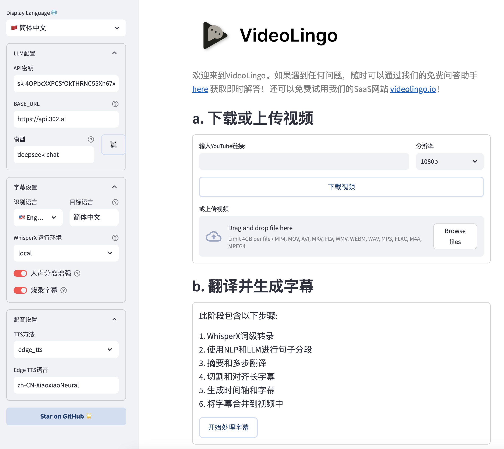

# 🚀 开始使用

## 📋 API 配置指南
本项目需使用大模型和 TTS。追求最佳质量请使用 `claude-sonnet-4.6` 或 `gpt-5.4` 与 Azure TTS。也可以选择完全本地化体验，使用 Ollama 作为大模型，Edge TTS 作为配音，无需任何 API key（此时需要在 `config.yaml` 中将 `max_workers` 设为 1，`summary_length` 调低至 2000）。

### 1. **大模型的 API_KEY**：

| 推荐模型 | 厂商 | 效果 | 性价比 |
|:-----|:---------|:-----|:---------|
| claude-sonnet-4-6 | [Anthropic](https://www.anthropic.com) | 🤩 | ⭐⭐⭐ |
| claude-opus-4-6 | [Anthropic](https://www.anthropic.com) | 🏆 | ⭐⭐ |
| gpt-5.2 | [OpenAI](https://openai.com) | 🤩 | ⭐⭐⭐ |
| gemini-3-flash | [Google](https://ai.google.dev) | 😃 | ⭐⭐⭐⭐⭐ |
| gemini-3.1-pro | [Google](https://ai.google.dev) | 🤩 | ⭐⭐⭐ |
| minimax-m2.5 | [MiniMax](https://www.minimax.io) | 😃 | ⭐⭐⭐⭐⭐ |
| kimi-k2.5 | [Moonshot AI](https://www.moonshot.cn) | 😃 | ⭐⭐⭐⭐ |
| deepseek-v3 | [DeepSeek](https://www.deepseek.com) | 🥳 | ⭐⭐⭐⭐ |
| qwen3-32b | [Ollama](https://ollama.ai) 本地部署 | 😃 | ♾️ 免费 |

> **提示：** 模型价格变动频繁，请前往各厂商官网查看最新定价。[models.dev](https://models.dev) 可横向比较各家模型的价格和能力。
>
> **API 中转推荐：** 如果无法直接访问海外 API，推荐使用 [OpenRouter](https://openrouter.ai)（支持上述所有海外模型，统一 OpenAI 格式接口，按量付费无月费）。

注：支持 OpenAI 格式接口，可自行尝试不同模型。但处理过程涉及多步思维链和复杂的json格式，**不建议使用小于 30B 的模型**。

### 2. **TTS 的 API**
VideoLingo提供了多种 tts 接入方式，以下是对比（如不使用配音可跳过）

| TTS 方案 | 提供商 | 优点 | 缺点 | 中文效果 | 非中文效果 |
|:---------|:---------|:-----|:-----|:---------|:-----------|
| 🔊 Azure TTS ⭐ | [302AI](https://gpt302.saaslink.net/C2oHR9) | 效果自然 | 情感不够丰富 | 🤩 | 😃 |
| 🎙️ OpenAI TTS | [302AI](https://gpt302.saaslink.net/C2oHR9) | 情感真实 | 中文听起来像外国人 | 😕 | 🤩 |
| 🎤 Fish TTS | [302AI](https://gpt302.saaslink.net/C2oHR9) | 真是本地人 | 官方模型有限 | 🤩 | 😂 |
| 🎙️ SiliconFlow FishTTS | [硅基流动](https://cloud.siliconflow.cn/i/ttKDEsxE) | 语音克隆 | 克隆效果不稳定 | 😃 | 😃 |
| 🗣 Edge TTS | 本地 | 完全免费 | 效果一般 | 😐 | 😐 |
| 🗣️ GPT-SoVITS | 本地 | 最强语音克隆 | 只支持中英文，需要本地训练推理，配置麻烦 | 🏆 | 🚫 |

- SiliconFlow FishTTS 请在 [硅基流动](https://cloud.siliconflow.cn/i/ttKDEsxE) 获取key，注意克隆功能需要付费充值积分；
- OpenAI TTS、Azure TTS 和 Fish TTS，仅支持 [302AI](https://gpt302.saaslink.net/C2oHR9) - 一个 API key 即可使用所有服务
> 现在还可以在 `core/all_tts_functions/custom_tts.py` 里自定义tts渠道！

<details>
<summary>SiliconFlow FishTTS 使用教程</summary>

目前支持 3 种模式：

1. `preset`: 使用固定音色，可以在 [官网Playground](https://cloud.siliconflow.cn/playground/text-to-speech/17885302608) 试听，默认 `anna`。
2. `clone(stable)`: 对应 fishtts api 的 `custom`，使用一段上传音频的音色，会自动采集视频前十秒声音作为音色使用，音色一致性更好。
3. `clone(dynamic)`: 对应 fishtts api 的 `dynamic`，在 tts 过程使用每一句作为参考音频，可能出现音色不一致，但效果更好。

</details>

<details>
<summary>OpenAI 声音怎么选？</summary>

声音列表可以在 [官网](https://platform.openai.com/docs/guides/text-to-speech/voice-options) 找到，例如 `alloy`, `echo`, `nova`等，在 `config.yaml` 中修改 `openai_tts.voice` 即可。

</details>
<details>
<summary>Azure 声音怎么选？</summary>

建议在 [在线体验](https://speech.microsoft.com/portal/voicegallery) 中试听选择你想要的声音，在右边的代码中可以找到该声音对应的代号，例如 `zh-CN-XiaoxiaoMultilingualNeural`

</details>

<details>
<summary>Fish TTS 声音怎么选？</summary>

前往 [官网](https://fish.audio/zh-CN/) 中试听选择你想要的声音，在 URL 中可以找到该声音对应的代号，例如丁真是 `54a5170264694bfc8e9ad98df7bd89c3`，热门的几种声音已添加在 `config.yaml` 中。如需使用其他声音，请在 `config.yaml` 中修改 `fish_tts.character_id_dict` 字典。

</details>

<details>
<summary>GPT-SoVITS-v2 使用教程</summary>

1. 前往 [官方的语雀文档](https://www.yuque.com/baicaigongchang1145haoyuangong/ib3g1e/dkxgpiy9zb96hob4#KTvnO) 查看配置要求并下载整合包。

2. 将 `GPT-SoVITS-v2-xxx` 与 `VideoLingo` 放在同一个目录下。**注意是两文件夹并列。**

3. 选择以下任一方式配置模型：

   a. 自训练模型：
   - 训练好模型后， `GPT-SoVITS-v2-xxx\GPT_SoVITS\configs` 下的 `tts_infer.yaml` 已自动填写好你的模型地址，将其复制并重命名为 `你喜欢的英文角色名.yaml`
   - 在和 `yaml` 文件同个目录下，放入后续使用的参考音，命名为 `你喜欢的英文角色名_参考音频的文字内容.wav` 或 `.mp3`，例如 `Huanyuv2_你好，这是一条测试音频.wav`
   - 在 VideoLingo 网页的侧边栏中，将 `GPT-SoVITS 角色` 配置为 `你喜欢的英文角色名`。

   b. 使用预训练模型：
   - 从 [这里](https://vip.123pan.cn/1817874751/8137723) 下载我的模型，解压后覆盖到 `GPT-SoVITS-v2-xxx`。
   - 在 `GPT-SoVITS 角色` 配置为 `Huanyuv2`。

   c. 使用其他训练好的模型：
   - 将 `xxx.ckpt` 模型文件放在 `GPT_weights_v2` 文件夹下，将 `xxx.pth` 模型文件放在 `SoVITS_weights_v2` 文件夹下。
   - 参考方法 a，重命名 `tts_infer.yaml` 文件，并修改文件中的 `custom` 部分的 `t2s_weights_path` 和 `vits_weights_path` 指向你的模型，例如：
  
      ```yaml
      # 示例 法 b 的配置：
      t2s_weights_path: GPT_weights_v2/Huanyu_v2-e10.ckpt
      version: v2
      vits_weights_path: SoVITS_weights_v2/Huanyu_v2_e10_s150.pth
      ```
   - 参考方法 a，在和 `yaml` 文件同个目录下，放入后续使用的参考音频，命名为 `你喜欢的英文角色名_参考音频的文字内容.wav` 或 `.mp3`，例如 `Huanyuv2_你好，这是一条测试音频.wav`，程序会自动识别并使用。
   - ⚠️ 警告：**请使用英文命名 `角色名`** ，否则会出现错误。 `参考音频的文字内容` 可以使用中文。目前仍处于测试版，可能产生报错。


   ```
   # 期望的目录结构：
   .
   ├── VideoLingo
   │   └── ...
   └── GPT-SoVITS-v2-xxx
       ├── GPT_SoVITS
       │   └── configs
       │       ├── tts_infer.yaml
       │       ├── 你喜欢的英文角色名.yaml
       │       └── 你喜欢的英文角色名_参考音频的文字内容.wav
       ├── GPT_weights_v2
       │   └── [你的GPT模型文件]
       └── SoVITS_weights_v2
           └── [你的SoVITS模型文件]
   ```
        
配置完成后，注意在网页侧边栏选择 `参考音频模式`（具体原理可以参考语雀文档），VideoLingo 在配音步骤时会自动在弹出的命令行中打开 GPT-SoVITS 的推理 API 端口，配音完成后可手动关闭。注意，此方法的稳定性取决于选择的底模。</details>

## 🛠️ 快速上手

VideoLingo 支持 Windows、macOS 和 Linux 系统，可使用 CPU 或 GPU 运行。

> **注意:** 在 Windows 上使用 NVIDIA GPU 加速，请先完成以下步骤:
> 1. 安装 [CUDA Toolkit 12.6](https://developer.download.nvidia.com/compute/cuda/12.6.0/local_installers/cuda_12.6.0_560.76_windows.exe) 或更高版本（12.8 / 12.9 / 13.x 均可，安装脚本会自动适配）
> 2. 安装 [CUDNN 9.3.0](https://developer.download.nvidia.com/compute/cudnn/9.3.0/local_installers/cudnn_9.3.0_windows.exe)
> 3. 将 `C:\Program Files\NVIDIA\CUDNN\v9.3\bin\12.6` 添加到系统 PATH
> 4. 重启电脑
>
> ⚠️ **踩坑提示:** 安装脚本通过 `nvidia-smi` 检测驱动的 CUDA 版本，自动选择合适的 PyTorch 轮子（cu129 / cu128 / cu126）。RTX 50 系列（Blackwell）显卡会自动选择包含 sm_100 内核的 cu129 轮子。**不需要手动安装 cu130/cu131 的 PyTorch**——这会导致 ctranslate2 找不到 `cublas64_12.dll` 而报错。

> **注意:** FFmpeg 是必需的，请通过包管理器安装：
> - Windows：```choco install ffmpeg```（通过 [Chocolatey](https://chocolatey.org/)）
> - macOS：```brew install ffmpeg```（通过 [Homebrew](https://brew.sh/)）
> - Linux：```sudo apt install ffmpeg```（Debian/Ubuntu）
>
> ⚠️ **踩坑提示:** 不要使用 conda-forge 的 ffmpeg（缺少 libmp3lame 编码器）。建议用系统包管理器安装完整版。

### 方式一：使用 uv（推荐）

[uv](https://docs.astral.sh/uv/) 是一个快速的 Python 包管理器，能自动下载正确版本的 Python 并创建隔离环境。无需手动安装 Python 或 Anaconda（~30 MB vs Anaconda 的 ~4 GB，包安装速度快 10-100 倍）。

1. 克隆项目：
   ```bash
   git clone https://github.com/Huanshere/VideoLingo.git
   cd VideoLingo
   ```

2. 一键安装（自动安装 uv + Python 3.10 + 所有依赖）：
   ```bash
   python setup_env.py
   ```

   > ⚠️ **安装顺序说明:** `install.py`（由 `setup_env.py` 自动调用）会按正确顺序安装依赖：先装 PyTorch（锁定 CUDA 版本），再用 `--no-deps` 装 demucs（避免 torchaudio 被降级），最后装其余依赖。**不要手动打乱顺序。**

3. 🎉 启动 Streamlit 应用：
   ```bash
   .venv\Scripts\streamlit run st.py        # Windows
   .venv/bin/streamlit run st.py            # macOS / Linux
   ```
   或在 Windows 上双击 `OneKeyStart_uv.bat`。

4. 在弹出网页的侧边栏中设置 key，开始使用~

### 方式二：使用 Conda

> ⚠️ **不推荐。** 此方式今后将不再维护，请使用上方的 uv（方式一）。

<details>
<summary>点击展开 Conda 安装步骤</summary>

开始安装 VideoLingo 之前，请确保安装了 Git 和 Anaconda。

1. 克隆项目：
   ```bash
   git clone https://github.com/Huanshere/VideoLingo.git
   cd VideoLingo
   ```

2. 创建并激活虚拟环境（**必须使用 3.10**）：
   ```bash
   conda create -n videolingo python=3.10.0 -y
   conda activate videolingo
   ```

   > ⚠️ **踩坑提示:** 请确保用的是 conda 环境里的 pip。如果 Windows 系统的 `site-packages` 不可写（如 `C:\ProgramData\anaconda3\`），pip 会悄悄把包装到用户目录，导致 conda 环境里找不到。遇到此问题可以用管理员权限运行终端。

3. 运行安装脚本：
   ```bash
   python install.py
   ```

   > ⚠️ **安装顺序说明:** `install.py` 会按正确顺序安装依赖：先装 PyTorch（锁定 CUDA 版本），再用 `--no-deps` 装 demucs（避免 torchaudio 被降级），最后装其余依赖。**不要手动打乱顺序。**

4. 🎉 输入命令或双击 `OneKeyStart.bat` 启动 Streamlit 应用：
   ```bash
   streamlit run st.py
   ```

5. 在弹出网页的侧边栏中设置key，开始使用~

</details>

   

6. （可选）更多设置可以在 `config.yaml` 中手动修改，运行过程请注意命令行输出。如需使用自定义术语，请在处理前将术语添加到 `custom_terms.xlsx` 中，例如 `Biden | 登子 | 美国的瞌睡总统`。

> 需要帮助？我们的 [AI助手](https://share.fastgpt.in/chat/share?shareId=066w11n3r9aq6879r4z0v9rh) 随时解答问题！


## 🏭 批量模式（beta）

使用说明: [English](/batch/README.md) | [简体中文](/batch/README.zh.md)

这个模式仍处于早期开发阶段，可能有潜在的错误。

## 🚨 常见报错与踩坑

1. **翻译过程的 'All array must be of the same length' 或 'Key Error'**: 
   - 原因1：弱模型遵循JSON格式能力较弱导致响应解析错误。
   - 原因2：对于敏感内容，LLM可能拒绝翻译。
   解决方案：检查 `output/gpt_log/error.json` 的 `response` 和 `msg` 字段，删掉 `output/gpt_log` 文件夹后重试。

2. **'Retry Failed', 'SSL', 'Connection', 'Timeout'**: 通常是网络问题。解决方案：中国大陆用户请切换网络节点重试。

3. **local_files_only=True**：网络问题引起的模型下载失败，需要确认网络能 ping 通 `huggingface.co`。

4. **`cublas64_12.dll not found`**: 安装了 CUDA 13.x 后使用了 cu130/cu131 PyTorch 轮子。**解决方案：** 必须使用 cu129、cu128 或 cu126 轮子（`install.py` 已通过 `nvidia-smi` 自动检测处理），因为 ctranslate2 只支持 CUDA 12。重新运行 `python install.py` 即可。

5. **Whisper 模型加载时无报错直接段错误 (Segfault)**: ctranslate2 版本与 cuDNN 版本不匹配。**解决方案：** 确保 `ctranslate2>=4.5.0`（支持 cuDNN 9，PyTorch 2.6+ 自带 cuDNN 9）。

6. **`RuntimeError: Weights only load failed`**: PyTorch ≥2.6 更改了 `torch.load` 的默认行为。**解决方案：** 已在 `whisperX_local.py` 中通过猴补丁修复，如果遇到此问题说明代码未正确更新。

7. **Streamlit 中 WhisperX 转录卡住不动（CPU/GPU 均空闲）**: `librosa.load()` 在 Streamlit 的非主线程中死锁。**解决方案：** 已用 `whisperx.audio.load_audio()`（基于 ffmpeg 子进程）替换。如果遇到此问题说明代码未正确更新。

8. **spacy 模型 `Can't find model 'xx_core_web_md'`（但 pip 显示已安装）**: pip 将模型安装到了用户目录而非 conda 环境。**解决方案：** 用管理员权限运行终端，或手动指定 conda 环境的 python 路径安装：
   ```bash
   python -m pip install xx-core-web-md --no-user --force-reinstall --no-deps
   ```

9. **pip 安装后 torchaudio 版本变成 1.x 或 2.1.x**: demucs 的 `torchaudio<2.2` 约束导致降级。**解决方案：** 不要手动 `pip install demucs`，必须用 `--no-deps` 安装。`install.py` 已正确处理。