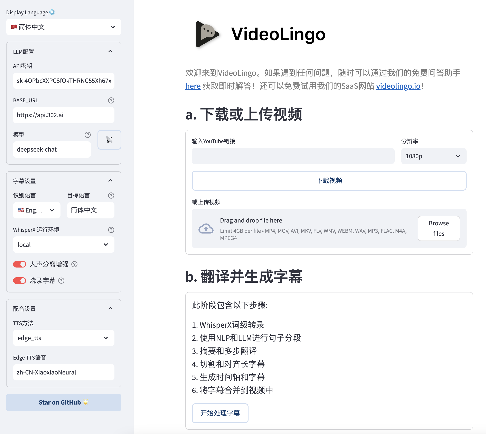

# 🚀 开始使用

## 📋 API 配置指南
VideoLingo 使用大模型进行翻译，TTS 仅在配音时需要。服务商和模型由用户自行选择。

### 1. **大模型的 API_KEY**：

在侧栏设置 API 地址、密钥和模型。客户端使用兼容 OpenAI 的 Chat Completions，
多个步骤需要结构化 JSON。选择接口实际支持的模型，参数量本身不能证明翻译质量
或 JSON 可靠性。仅在服务支持时开启 JSON 模式。

推荐使用 [OpenLux](https://www.openlux.ai/register?aff=wKYu) 中转，API 地址填 `https://api.openlux.ai/v1`。模型可按下面三档选。价格为 OpenLux 常见自动路由分组下的实测约价（美元 / 百万 token，随分组浮动）：

| 建议 | 模型 ID | 输入 | 输出 |
|:-----|:--------|-----:|-----:|
| 默认，性价比高 | `gpt-6-luna` | $0.006 | $0.029 |
| 质量更好 | `gpt-6-sol` | $0.074 | $0.37 |
| 质量最好 | `claude-opus-5-5` | $0.71 | $3.53 |

也可以使用其他兼容服务，例如 OpenRouter，地址填 `https://openrouter.ai/api/v1`，或使用本地兼容服务。即使服务不验证凭据，应用仍要求密钥字段非空，只有在服务明确忽略密钥时才使用占位值。Edge TTS 需要联网，不是离线语音合成。

### 2. **TTS 的 API**
VideoLingo提供了多种 tts 接入方式，以下是对比（如不使用配音可跳过）

| TTS 方案 | 提供商 | 优点 | 缺点 | 中文效果 | 非中文效果 |
|:---------|:---------|:-----|:-----|:---------|:-----------|
| 🔊 Azure TTS ⭐ | [302AI](https://gpt302.saaslink.net/C2oHR9) | 效果自然 | 情感不够丰富 | 🤩 | 😃 |
| 🎙️ OpenAI TTS | [302AI](https://gpt302.saaslink.net/C2oHR9) | 情感真实 | 中文听起来像外国人 | 😕 | 🤩 |
| 🎤 Fish TTS | [302AI](https://gpt302.saaslink.net/C2oHR9) | 真是本地人 | 官方模型有限 | 🤩 | 😂 |
| 🎙️ SiliconFlow FishTTS | [硅基流动](https://cloud.siliconflow.cn/i/ttKDEsxE) | 语音克隆 | 克隆效果不稳定 | 😃 | 😃 |
| Edge TTS | 在线服务 | 此适配器无需单独 API 密钥 | 需要联网 | — | — |
| 🗣️ GPT-SoVITS | 本地 | 最强语音克隆 | 只支持中英文，需要本地训练推理，配置麻烦 | 🏆 | 🚫 |

- SiliconFlow FishTTS 请在 [硅基流动](https://cloud.siliconflow.cn/i/ttKDEsxE) 获取key，注意克隆功能需要付费充值积分；
- OpenAI TTS、Azure TTS 和 Fish TTS，仅支持 [302AI](https://gpt302.saaslink.net/C2oHR9) - 一个 API key 即可使用所有服务
> 自定义 TTS 适配器位于 `core/tts_backend/custom_tts.py`。

<details>
<summary>SiliconFlow FishTTS 使用教程</summary>

目前支持 3 种模式：

1. `preset`: 使用固定音色，可以在 [官网Playground](https://cloud.siliconflow.cn/playground/text-to-speech/17885302608) 试听，默认 `anna`。
2. `clone(stable)`：API 模式 `custom`，按文本长度和时长限制，从任务列表选择合适的参考片段合并并上传为可复用音色，不一定是视频最初十秒。
3. `clone(dynamic)`：API 模式 `dynamic`，使用当前句子的参考片段。音色一致性和质量取决于参考音频及服务，不保证比 custom 模式更好。

</details>

<details>
<summary>OpenAI 声音怎么选？</summary>

声音列表可以在 [官网](https://platform.openai.com/docs/guides/text-to-speech/voice-options) 找到，例如 `alloy`, `echo`, `nova`等，在 `config.yaml` 中修改 `openai_tts.voice` 即可。

</details>
<details>
<summary>Azure 声音怎么选？</summary>

建议在 [在线体验](https://speech.microsoft.com/portal/voicegallery) 中试听选择你想要的声音，在右边的代码中可以找到该声音对应的代号，例如 `zh-CN-XiaoxiaoMultilingualNeural`

</details>

<details>
<summary>Fish TTS 声音怎么选？</summary>

前往 [官网](https://fish.audio/zh-CN/) 中试听选择你想要的声音，在 URL 中可以找到该声音对应的代号，例如丁真是 `54a5170264694bfc8e9ad98df7bd89c3`，热门的几种声音已添加在 `config.yaml` 中。如需使用其他声音，请在 `config.yaml` 中修改 `fish_tts.character_id_dict` 字典。

</details>

<details>
<summary>GPT-SoVITS-v2 使用教程</summary>

1. 前往 [官方的语雀文档](https://www.yuque.com/baicaigongchang1145haoyuangong/ib3g1e/dkxgpiy9zb96hob4#KTvnO) 查看配置要求并下载整合包。

2. 将 `GPT-SoVITS-v2-xxx` 与 `VideoLingo` 放在同一个目录下。**注意是两文件夹并列。**

3. 选择以下任一方式配置模型：

   a. 自训练模型：
   - 训练好模型后， `GPT-SoVITS-v2-xxx\GPT_SoVITS\configs` 下的 `tts_infer.yaml` 已自动填写好你的模型地址，将其复制并重命名为 `你喜欢的英文角色名.yaml`
   - 在和 `yaml` 文件同个目录下，放入后续使用的参考音，命名为 `你喜欢的英文角色名_参考音频的文字内容.wav` 或 `.mp3`，例如 `Huanyuv2_你好，这是一条测试音频.wav`
   - 在 VideoLingo 网页的侧边栏中，将 `GPT-SoVITS 角色` 配置为 `你喜欢的英文角色名`。

   b. 使用预训练模型：
   - 从 [这里](https://vip.123pan.cn/1817874751/8137723) 下载我的模型，解压后覆盖到 `GPT-SoVITS-v2-xxx`。
   - 在 `GPT-SoVITS 角色` 配置为 `Huanyuv2`。

   c. 使用其他训练好的模型：
   - 将 `xxx.ckpt` 模型文件放在 `GPT_weights_v2` 文件夹下，将 `xxx.pth` 模型文件放在 `SoVITS_weights_v2` 文件夹下。
   - 参考方法 a，重命名 `tts_infer.yaml` 文件，并修改文件中的 `custom` 部分的 `t2s_weights_path` 和 `vits_weights_path` 指向你的模型，例如：
  
      ```yaml
      # 示例 法 b 的配置：
      t2s_weights_path: GPT_weights_v2/Huanyu_v2-e10.ckpt
      version: v2
      vits_weights_path: SoVITS_weights_v2/Huanyu_v2_e10_s150.pth
      ```
   - 参考方法 a，在和 `yaml` 文件同个目录下，放入后续使用的参考音频，命名为 `你喜欢的英文角色名_参考音频的文字内容.wav` 或 `.mp3`，例如 `Huanyuv2_你好，这是一条测试音频.wav`，程序会自动识别并使用。
   - ⚠️ 警告：**请使用英文命名 `角色名`** ，否则会出现错误。 `参考音频的文字内容` 可以使用中文。目前仍处于测试版，可能产生报错。


   ```
   # 期望的目录结构：
   .
   ├── VideoLingo
   │   └── ...
   └── GPT-SoVITS-v2-xxx
       ├── GPT_SoVITS
       │   └── configs
       │       ├── tts_infer.yaml
       │       ├── 你喜欢的英文角色名.yaml
       │       └── 你喜欢的英文角色名_参考音频的文字内容.wav
       ├── GPT_weights_v2
       │   └── [你的GPT模型文件]
       └── SoVITS_weights_v2
           └── [你的SoVITS模型文件]
   ```
        
配置完成后，注意在网页侧边栏选择 `参考音频模式`（具体原理可以参考语雀文档），VideoLingo 在配音步骤时会自动在弹出的命令行中打开 GPT-SoVITS 的推理 API 端口，配音完成后可手动关闭。注意，此方法的稳定性取决于选择的底模。</details>

## 🛠️ 快速上手

VideoLingo 支持 Windows、macOS 和 Linux 系统，可使用 CPU 或 GPU 运行。

### 安装前准备

先安装 [Git](https://git-scm.com/downloads)、[uv](https://docs.astral.sh/uv/getting-started/installation/) 和 [FFmpeg](https://ffmpeg.org/download.html)。uv 链接提供不依赖 Python 的独立安装方式。重新打开终端，检查 `git --version`、`uv --version` 和 `ffmpeg -version`。

Windows 可选择 FFmpeg 官网列出的 Windows 构建，将 `bin` 目录加入 PATH。macOS 使用 `brew install ffmpeg`，Debian/Ubuntu 使用 `sudo apt install ffmpeg`。默认的 Qwen3-ASR 识别只调用 FFmpeg 命令行程序；FFmpeg 共享库和「FFmpeg 4–7」的版本限制只针对可选的 WhisperX（见 [WhisperX（可选）](whisperx-optional.zh-CN.md#ffmpeg-runtime)）。字幕烧录需要 subtitles 滤镜和合适的字体，安装器会在 Linux 上检查并尝试安装 Noto CJK 字体。

<a id="asr-runtime"></a>
### 语音识别（Qwen3-ASR + ForcedAligner）

本地识别默认使用 **Qwen3-ASR** 转写，再用 **Qwen3-ForcedAligner-0.6B** 生成词级时间轴。开启人声分离时，转写用原始音频，对齐用分离出的人声。

- **模型大小**：侧栏「Qwen3-ASR 模型大小」或 `config.yaml` 的 `whisper.qwen_model`。`1.7b`（默认）更准确；`0.6b` 更快、更省显存。对齐模型固定为 ForcedAligner-0.6B。
- **推理引擎**：`whisper.qwen_engine: auto` 时自动选择，一般不需要改。

| 平台 | 引擎 | 模型 | 说明 |
|:-----|:-----|:-----|:-----|
| Apple Silicon Mac | MLX（mlx-audio） | `mlx-community/Qwen3-ASR-{1.7B,0.6B}-8bit`、`mlx-community/Qwen3-ForcedAligner-0.6B-8bit` | 需要 **macOS 14 或更高**（mlx 只提供 macOS ≥14 的 arm64 包） |
| Windows / Linux + NVIDIA | 官方 qwen-asr（transformers） | `Qwen/Qwen3-ASR-{1.7B,0.6B}`、`Qwen/Qwen3-ForcedAligner-0.6B` | `cuda:0`，显卡支持 bf16 时用 bf16，否则 fp16 |
| Windows / Linux 无 NVIDIA | 同上 | 同上 | CPU fp32，可以运行但**很慢**，建议选 0.6B 或改用 ElevenLabs |
| Intel Mac | — | — | 仓库固定的 PyTorch 2.8 没有 macOS x86_64 安装包，目前无法安装；安装器会在安装依赖前直接报错退出 |

- 在 Apple Silicon 上，默认依赖只安装 mlx-audio，不安装 qwen-asr；要用 `qwen_engine: transformers` 需要另建环境。macOS 低于 14 时安装器会直接报错退出。旧环境里如果装过 WhisperX，重跑 `installer.py` 时会先卸载WhisperX 整套依赖（whisperx、torchcodec、faster-whisper、ctranslate2、pyannote-*），它们与 MLX 依赖冲突。
- **模型下载**：首次识别时从 Hugging Face 下载，1.7B 加对齐模型共数 GB。可用 `HF_ENDPOINT` 指定镜像。如果 `_model_cache/<仓库名末段>/config.json` 存在（例如 `_model_cache/Qwen3-ASR-1.7B`），会直接使用这份本地模型。
- **语言**：侧栏「识别语言」中的语言都受支持（Qwen3-ASR 共支持 30 种语言）。选 `Auto` 时，每个约 3 分钟的窗口先取最多 3 段 20 秒的片段检测语言并投票，再以投票结果强制该语言转写整窗（识别时间约增加三分之一）；中英混说时以第一语言为准。Auto 检测出侧栏以外的语言（如韩语、越南语、泰语）时，后续断句会自动选用空格或无空格拼接，并使用对应的 spaCy 模型（没有时按标点断句）。
- **异常输出检测**：如果某个窗口的结果是同一短语循环重复，或明显少于检测片段听到的内容，会先切成 60 秒的小窗重试；仍然异常时直接报错，提示明确选择识别语言，而不会把残缺的结果交给后续步骤。手动指定语言时，如果某个窗口的文字异常稀少（每秒不到 2 个字母/数字），会额外用 auto 检测几段片段；片段听到的内容远多于转写结果时同样重试并报错，并提示「识别语言可能选错，试试 auto」。静音和纯音乐不会触发报错。
- 识别结果缓存区分后端、模型大小和引擎，切换任一项都会重新识别。
- 想继续使用 WhisperX（包括中文 Belle 模型），见 [WhisperX（可选）](whisperx-optional.zh-CN.md)。WhisperX 默认不安装。
- 也可以使用官方 Docker 镜像 `qwenllm/qwen3-asr` 单独部署 Qwen3-ASR 服务，但 VideoLingo 目前不直接调用它。

<a id="gpu-runtime"></a>
### GPU 运行库

- 安装与 NVIDIA 显卡兼容的驱动。`nvidia-smi` 显示的是驱动支持的 CUDA 版本，不是已安装的 Toolkit 版本。
- 主机安装器在驱动报告 >=12.8 时选择 PyTorch `cu128`，否则在检测到 NVIDIA 时选择 `cu126`。无法读取支持版本时也回退到 cu126，但这不保证旧驱动一定兼容。没有 NVIDIA 则选择 CPU 包，已有兼容包可能直接复用。
- 默认的 Qwen3-ASR 通过 PyTorch 运行，使用 PyTorch 安装包自带的 CUDA 运行库，不需要另外安装 cuBLAS/cuDNN。可选的 WhisperX 需要 CUDA 12 cuBLAS 和 cuDNN 9，见 [WhisperX（可选）](whisperx-optional.zh-CN.md#cuda-runtime)。

安装器选择的是 Python 包，不会安装系统 CUDA Toolkit。支持 CUDA 13 的新驱动不代表本项目需要 CUDA 13 的 Python 包。

### 使用 uv 安装

uv 创建使用 Python 3.13 的 `.venv`，已有应用环境支持 Python 3.10–3.13。下面的引导命令不需要预装 Python。

1. 克隆项目：
   ```bash
   git clone https://github.com/Huanshere/VideoLingo.git
   cd VideoLingo
   ```

2. 创建环境并安装依赖：
   ```bash
    uv run --no-project --python 3.13 setup_env.py
   ```

   `setup_env.py` 调用 `installer.py`：先安装基础工具和匹配的 Torch/torchaudio/torchvision，再安装应用依赖（含 Qwen3-ASR：Apple Silicon 为 mlx-audio，其余平台为 qwen-asr）、检查 spaCy、安装可选的 PyPI Demucs 4.1，最后登记项目、检查字体及环境。Demucs 使用正常依赖解析。`--shared` 选择 `~/.venvs/videolingo`，`--path` 可指定其他目录。

3. 🎉 启动 Streamlit 应用：
   ```bash
   .venv\Scripts\streamlit run st.py        # Windows
   .venv/bin/streamlit run st.py            # macOS / Linux
   ```
   或在 Windows 上双击 `OneKeyStart.bat`。

4. 打开 `http://localhost:8501`，在侧栏配置兼容 OpenAI 的 API 地址、密钥和模型。`OneKeyStart.bat` 优先使用共享环境，其次使用项目 `.venv`；要明确使用当前项目环境，可执行上面的完整路径命令。

   

5. （可选）更多设置可以在 `config.yaml` 中手动修改。自定义术语请在处理前写入 `custom_terms.xlsx`，三列分别为原文、译文、备注。

> 需要帮助？我们的 [AI助手](https://share.fastgpt.in/chat/share?shareId=066w11n3r9aq6879r4z0v9rh) 随时解答问题！


## 🏭 批量模式（beta）

使用说明: [English](/batch/README.md) | [简体中文](/batch/README.zh.md)

这个模式仍处于早期开发阶段，可能有潜在的错误。

## 🚨 常见报错与踩坑

1. **翻译过程的 'All array must be of the same length' 或 'Key Error'**: 
   - 原因1：弱模型遵循JSON格式能力较弱导致响应解析错误。
   - 原因2：对于敏感内容，LLM可能拒绝翻译。
    检查 `output/gpt_log/error.json` 中的 `resp_content`、`resp`、`message`。校验失败记录与成功响应缓存分开保存，先确定出错步骤，再考虑清除该步骤的缓存。

2. **'Retry Failed', 'SSL', 'Connection', 'Timeout'**: 通常是网络问题。解决方案：中国大陆用户请切换网络节点重试。

3. **`Qwen ASR engine '...' needs the 'qwen-asr' package`（或 `mlx-audio`）**：当前环境没有安装对应的识别包。用启动 VideoLingo 的同一个环境执行 `python installer.py` 修复。Apple Silicon 上如果手动设置了 `qwen_engine: transformers`，请改回 `auto`。

4. **`Qwen3-ASR could not detect the language`** 或 **`... is still degenerate after retrying`**：`Auto` 模式下没能识别出语言，或识别结果退化（循环重复、内容过少）。在侧栏明确选择识别语言后重试，也可以换另一个模型大小。

5. **显存不足（CUDA out of memory）**：在侧栏把 Qwen3-ASR 模型大小改为 0.6B；也可以关闭其他占用显卡的程序。

6. **macOS 安装时报 mlx 无法解析 / 没有可用的安装包**：mlx 只提供 macOS 14 及以上的 Apple Silicon 安装包，请先升级系统。

7. **WhisperX 相关报错**（`cublas64_12.dll not found`、段错误、`Weights only load failed`、TorchCodec 等）：只在选择了 WhisperX 后端时出现，见 [WhisperX（可选）](whisperx-optional.zh-CN.md#common-errors)。

8. **spaCy 模型缺失**：检查模型是否安装在启动 VideoLingo 的同一个环境内。例如，用该环境的 Python 安装英语模型：
   ```bash
    .venv\Scripts\python -m spacy download en_core_web_md
   ```

9. **Torch 组件版本不一致**：用所选环境执行 `python installer.py --check`，再执行 `python installer.py` 修复。当前配套为 Torch/torchaudio 2.8.0、torchvision 0.23.0，三者采用同一 CPU/CUDA 构建。当前使用 PyPI Demucs 4.1，不再是需要 `--no-deps` 绕过依赖的旧 Git 包。
