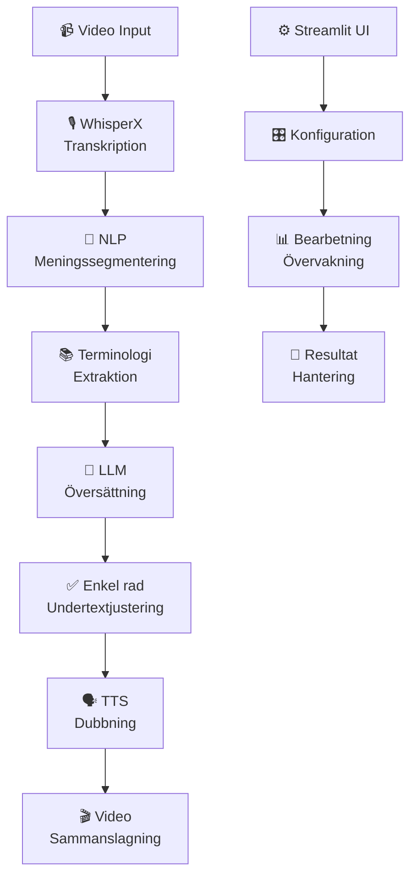

<div align="center">


# Koppla samman världen, bild för bild

<a href="https://trendshift.io/repositories/12200" target="_blank"></a>

[**English**](/README.md)｜[**简体中文**](/translations/README.zh.md)｜[**繁體中文**](/translations/README.zh-TW.md)｜[**日本語**](/translations/README.ja.md)｜[**Español**](/translations/README.es.md)｜[**Русский**](/translations/README.ru.md)｜[**Français**](/translations/README.fr.md)｜[**Svenska**](/translations/README.sv.md)

</div>

## 🌟 Översikt ([Prova VL nu!](https://videolingo.io))

VideoLingo är ett allt-i-ett-verktyg för videoöversättning, lokalisering och dubbning som syftar till att generera undertexter av Netflix-kvalitet. Det eliminerar stela maskinöversättningar och flerradiga undertexter samtidigt som det lägger till högkvalitativ dubbning, vilket möjliggör global kunskapsdelning över språkbarriärer.

Huvudfunktioner:
- 🎥 YouTube-videonedladdning via yt-dlp

- **🎙️ Ordnivå och låg-illusion undertexterkänning med WhisperX**

- **📝 NLP- och AI-driven undertextsegmentering**

- **📚 Anpassad + AI-genererad terminologi för sammanhängande översättning**

- **🔄 3-stegs Översätt-Reflektera-Anpassa för filmisk kvalitet**

- **✅ Netflix-standard, endast enkelradiga undertexter**

- **🗣️ Dubbning med GPT-SoVITS, Azure, OpenAI och fler**

- 🚀 Ett-klicks-start och bearbetning i Streamlit

- 🌍 Flerspråksstöd i Streamlit UI

- 📝 Detaljerad loggning med återupptagning av framsteg

- 🔍 Modellsökruta med API auto-hämtning — sök och filtrera från din leverantörs fullständiga modelllista

- ⏯️ Uppgiftskontroll — pausa, återuppta eller stoppa bearbetning vid valfritt steg

Skillnad från liknande projekt: **Endast enkelradiga undertexter, överlägsen översättningskvalitet, sömlös dubbningsupplevelse**

## 🎥 Demo

<table>
<tr>
<td width="33%">

### Dubbla undertexter
---
https://github.com/user-attachments/assets/a5c3d8d1-2b29-4ba9-b0d0-25896829d951

</td>
<td width="33%">

### Cosy2 röstkloning
---
https://github.com/user-attachments/assets/e065fe4c-3694-477f-b4d6-316917df7c0a

</td>
<td width="33%">

### GPT-SoVITS med min röst
---
https://github.com/user-attachments/assets/47d965b2-b4ab-4a0b-9d08-b49a7bf3508c

</td>
</tr>
</table>

### Språkstöd

**Stöd för inspelningsspråk (fler kommer):**

🇺🇸 Engelska 🤩 | 🇷🇺 Ryska 😊 | 🇫🇷 Franska 🤩 | 🇩🇪 Tyska 🤩 | 🇮🇹 Italienska 🤩 | 🇪🇸 Spanska 🤩 | 🇯🇵 Japanska 😐 | 🇨🇳 Kinesiska* 😊

> *Kinesiska använder en separat interpunktionsförstärkt whisper-modell, för tillfället...

**Översättning stöder alla språk, medan dubbningsspråk beror på den valda TTS-metoden.**

## ⭐ Star History

[](https://star-history.com/#Huanshere/VideoLingo&Timeline)

## 📖 Dokumentation

- [🚀 Snabbstart](https://videolingo.io/docs/start)
  
- [🎯 Steg-för-steg guide](https://videolingo.io/docs/guide)
  
- [🔧 API-konfiguration](https://videolingo.io/docs/api)
  
- [❓ Vanliga frågor](https://videolingo.io/docs/faq)

- [🗺️ Roadmap](https://videolingo.io/docs/roadmap)

- [📄 Licens](https://videolingo.io/docs/license)

---

## 🚗 Snabbstart

### Online-version
Besök [videolingo.io](https://videolingo.io) för att testa gratis utan installation

### Lokal installation

1. Säkerställ att Python 3.10+ är installerat
2. Installera FFmpeg:
   - Windows: `choco install ffmpeg`
   - macOS: `brew install ffmpeg`
   - Linux: `sudo apt install ffmpeg` eller `sudo yum install ffmpeg`
3. Klona repoet:
   ```bash
   git clone https://github.com/Huanshere/VideoLingo.git
   cd VideoLingo
   ```
4. Kör installationsskriptet och följ instruktionerna:
   ```bash
   python install.py
   ```

Applikationen kommer att öppnas automatiskt i din webbläsare på `http://localhost:8501`

> **💡 Tips:** Första uppstarten kan ta upp till 1 minut. Om installationen misslyckas, kontrollera din internetanslutning och kör `python install.py` igen.

---

## 🏗️ Arkitektur



## 🔧 Avancerad användning

### Batch-bearbetning

Placera videor i `inputs/` mappen och kör:
```bash
python batch_process.py
```

### API-användning

Starta API-servern:
```bash
python app.py --api
```

### Anpassad terminologi

Redigera `output/log/terminology.json` före översättning för att definiera specifika termer.

### Modellvärdering

Jämför olika LLM-modellers prestanda:
```bash
python benchmark.py
```

## 🤝 Bidrag

Vi välkomnar bidrag! Läs vår [bidragsguide](CONTRIBUTING.md) för detaljer.

### Utvecklingsmiljö

```bash
# Installera utvecklingsberoenden
pip install -r requirements-dev.txt

# Kör tester
python -m pytest tests/

# Formatera kod
black . && isort .
```

## 📄 Licens

Detta projekt är licensierat under Apache 2.0-licensen - se [LICENSE](LICENSE) filen för detaljer.

## 📞 Support

- 💬 [Discord Community](https://discord.gg/videolingo)
- 📧 Email: support@videolingo.io  
- 🐛 [Rapportera buggar](https://github.com/Huanshere/VideoLingo/issues)
- 💡 [Funktionsförfrågningar](https://github.com/Huanshere/VideoLingo/discussions)

## 🙏 Erkännanden

Tack till alla fantastiska open source-projekt som gör VideoLingo möjligt:

- **WhisperX** - Transkription med tidsstämplar
- **yt-dlp** - Video download
- **FFmpeg** - Video/ljudbearbetning  
- **Streamlit** - Webbgränssnitt
- **OpenAI** - LLM API
- **Azure Cognitive Services** - TTS
- **GPT-SoVITS** - Röstkloning

---

<div align="center">

**Gjord med ❤️ för den globala gemenskapen**

[⭐ Stjärnmärk detta repo](https://github.com/Huanshere/VideoLingo) • [🐛 Rapportera problem](https://github.com/Huanshere/VideoLingo/issues) • [💬 Gå med i Discord](https://discord.gg/videolingo)

</div>